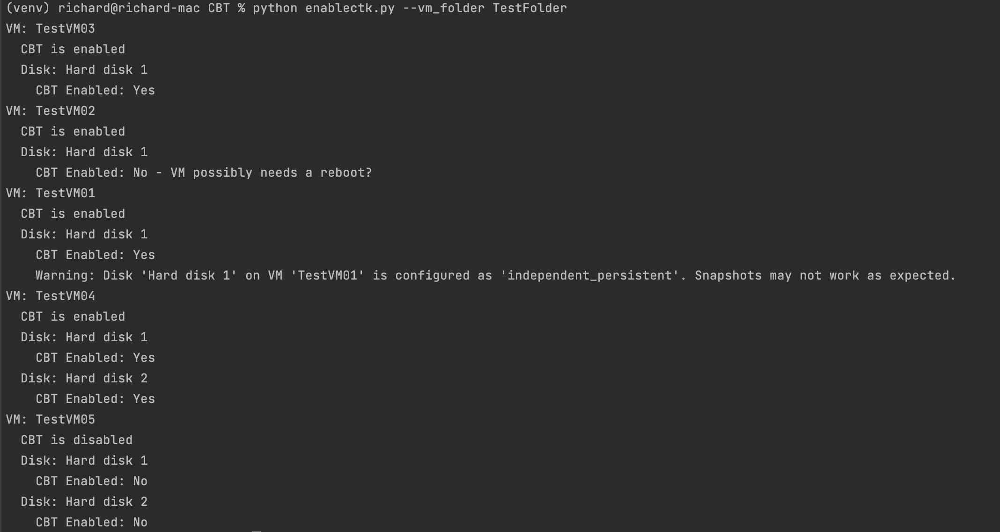
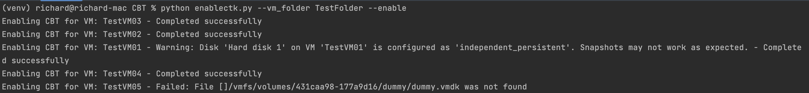
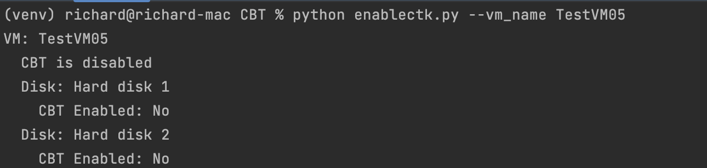

# ChangeBlockTracking
Script to get or set Change Block Tracking on VMware VMs
Created by Richard Garsthagen - February 22th 2024

This script is created to help with the setup of your VMs when using the
Oracle Cloud Migration Service. If you want your VMs to be replicated with only 
the last changes per replication cycle, you need to enable your VMs with Change Block Tracking (CBT)
https://kb.vmware.com/s/article/1020128

## Configuration:
- Configure in the config.ini file your vCenter connection details and credentials.
- install requirements: pip install -r requirements.txt

## Usage
show the status of a VM:
>python cbt.py --vm_name YourVMName

Enable CBT on a VM and its disks
>python cbt.py --vm_name YourVMName --enable

show the status of all VMs in a specific VM Folder
>python cbt.py --vm_folder VMFolderName

Enable CBT on all VMs in a specific VM Folder
>python cbt.py --vm_folder VMFolderName --enable

The script will also check if the VM's disk mode is set to Dependent. 
When the VM's disk mode does not match this, the disk can not have a snapshot. 
This will make OCM fail with replicating the VM.

